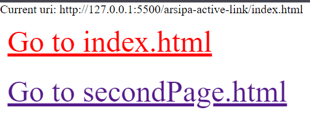
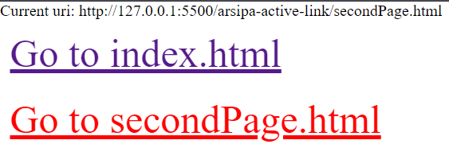

# arsipa-active-link
Simple js script that adds "**_arsipa-active-link_**" class to the <a> tag if the href attribute matches the current url
## Usage
[Npm page](https://www.npmjs.com/package/arsipa-active-link)

```npm -i arsipa-active-link```
## Add script
```<script src="node_modules/arsipa-active-link/index.js"></script>```
## Style
```.arsipa-active-page { color: red; }```
## Preview

